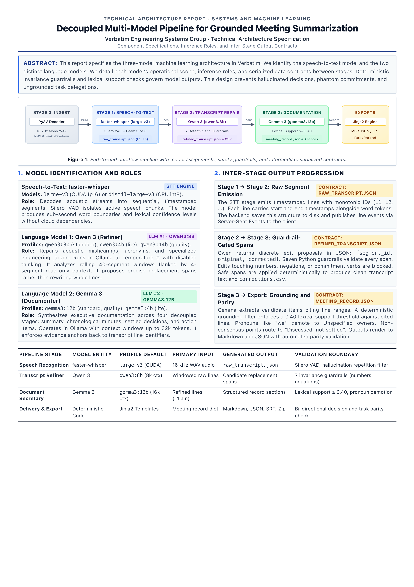

# Verbatim: AI-Powered Meeting Assistant



## Installation and Setup

### Prerequisites

- Python 3.10 or higher (Python 3.11 recommended)
- Ollama local LLM runtime
- Optional: NVIDIA GPU with CUDA 12 drivers for GPU acceleration

### 1. Clone the Repository

Open a terminal and navigate to the project directory:

```bash
git clone https://github.com/medharmurthy/AI-Powered-Meeting-Assistant.git
cd AI-Powered-Meeting-Assistant
```

### 2. Create and Activate a Virtual Environment

Create an isolated Python virtual environment:

On macOS and Linux:

```bash
python3 -m venv .venv
source .venv/bin/activate
```

On Windows:

```cmd
python -m venv .venv
.venv\Scripts\activate
```

### 3. Install Python Dependencies

Upgrade pip and install the required dependencies:

```bash
pip install --upgrade pip
pip install -r requirements.txt
```

For Linux systems with an NVIDIA GPU running CUDA 12, install the GPU acceleration libraries:

```bash
pip install nvidia-cublas-cu12 "nvidia-cudnn-cu12==9.*"
```

### 4. Install and Start Ollama

Verbatim requires Ollama for local LLM inference.

1. Download and install Ollama from [https://ollama.com](https://ollama.com).
2. Start the Ollama background service if it is not already running:

```bash
ollama serve
```

Configured default Ollama service address:
- Host URL: `http://127.0.0.1:11434`

### 5. Pull Required Ollama Models

Pull the models corresponding to your hardware profile.

For the standard profile (recommended for 8 GB VRAM):

```bash
ollama pull qwen3:8b
ollama pull gemma3:12b
```

For the lite profile (CPU or up to 6 GB VRAM):

```bash
ollama pull qwen3:4b
ollama pull gemma3:4b
```

For the quality profile (12 GB VRAM or higher):

```bash
ollama pull qwen3:14b
ollama pull gemma3:12b
```

Speech-to-text models (`large-v3` or `distil-large-v3`) download automatically from Hugging Face on the first transcription run.

### 6. Configure Environment Variables and Profiles

Configuration values can be adjusted via environment variables or through `config.yaml`.

Supported environment variables:
- `VERBATIM_PROFILE`: Overrides hardware auto-detection. Configurable values: `auto`, `lite`, `standard`, `quality`. Default value: `auto`.
- `VERBATIM_CONFIG`: Optional path to a custom YAML configuration file. Default value: `./config.yaml`.
- `VERBATIM_ROOT`: Optional custom path to the repository root directory.
- `VERBATIM_FAKE`: Set to `1` to use mock pipeline data for UI development without GPU or Ollama. Default value: not set.

To set a profile override in your terminal session (optional):

On macOS and Linux:

```bash
export VERBATIM_PROFILE=standard
```

On Windows:

```cmd
set VERBATIM_PROFILE=standard
```

Key configuration values in `config.yaml`:
- `profile`: `auto`
- `limits.max_upload_mb`: `500`
- `limits.allowed_ext`: `[wav, mp3, m4a, aac, flac, ogg, opus, webm, mp4, mov, mkv]`
- `llm.host`: `http://127.0.0.1:11434`
- `llm.temperature`: `0`
- `llm.seed`: `7`
- `stt.language`: `en`

### 7. Database Setup

No database setup or external database service is required. Verbatim uses file-based persistence. All run metadata, event logs, and generated artifacts are stored locally in the `runs/` directory.

### 8. Run the Application

The web user interface is pre-built into `backend/verbatim/static/` and served directly by the backend server.

Start the application:

```bash
python run.py
```

Optional terminal arguments for `run.py`:
- `--host`: Host IP address to bind (default: `127.0.0.1`)
- `--port`: Port number to bind (default: `8000`)
- `--reload`: Enables auto-reload for development
- `--no-browser`: Disables automatic browser launch

Example command running on a custom port without opening a browser:

```bash
python run.py --port 8080 --no-browser
```

Access the application in your browser:
- Web Application: `http://127.0.0.1:8000`
- Interactive API Documentation: `http://127.0.0.1:8000/api/docs`

### 9. Run via Command-Line Interface (Optional)

You can run the pipeline directly from the command line without launching the web server.

```bash
python -m verbatim.cli samples/sample_meeting.mp3 --stage all
```

Configurable options for the CLI:
- `--stage`: Stage to execute. Configurable values: `stt`, `refine`, `document`, `all` (default: `stt`).
- `--profile`: Profile override (`lite`, `standard`, `quality`).
- `--glossary`: Optional list of domain terms.
- `--participants`: Optional list of meeting attendees.
- `--model`: Optional speech-to-text model override.

### 10. Run the Test Suite (Optional)

Execute the test suite to verify the installation:

```bash
pytest
```

### 11. Rebuild Frontend Assets (Optional)

Rebuilding the frontend is only necessary when modifying files in `frontend/`. Pre-built assets are already included in the repository.

Prerequisites for frontend development:
- Node.js (version 18 or higher)
- npm

Commands to install frontend dependencies and build assets:

```bash
cd frontend
npm install
npm run build
cd ..
```

The build command compiles assets directly into `backend/verbatim/static/`.
